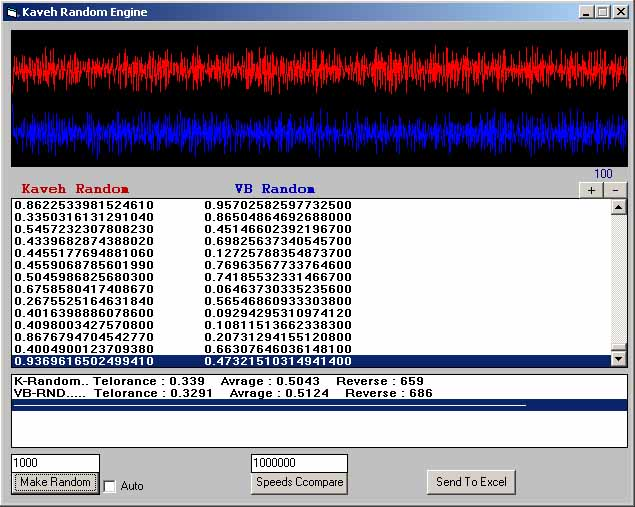



## Kaveh Random Number Generator

### Description

Random Number Genarator.

Analysis And Compare Random Numbers.
 
### More Info
 

             |
---                |---
**Submitted On**   |2010-03-26 23:28:16
**By**             |[Kaveh Abdollahi](https://github.com/Planet-Source-Code/PSCIndex/blob/master/ByAuthor/kaveh-abdollahi.md)
**Level**          |Intermediate
**User Rating**    |5.0 (10 globes from 2 users)
**Compatibility**  |VB 6\.0
**Category**       |[Math/ Dates](https://github.com/Planet-Source-Code/PSCIndex/blob/master/ByCategory/math-dates__1-37.md)
**World**          |[Visual Basic](https://github.com/Planet-Source-Code/PSCIndex/blob/master/ByWorld/visual-basic.md)
**Archive File**   |[Kaveh\_Rand2178013272010\.zip](https://github.com/Planet-Source-Code/kaveh-abdollahi-kaveh-random-number-generator__1-73039/archive/master.zip)

